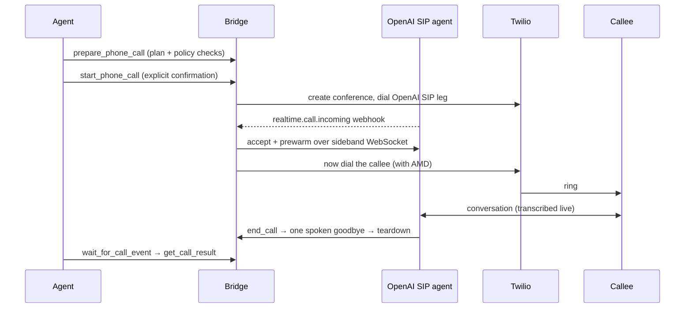

# Agent Call

[](https://github.com/XiyaoWang0519/agent-call/actions/workflows/ci.yml)
[](https://github.com/XiyaoWang0519/agent-call/actions/workflows/secret-scan.yml)
[](https://www.python.org/downloads/)
[](LICENSE)
[](#project-status)

Agent Call is a **self-hosted, single-owner MCP bridge** that connects an AI agent to outbound phone calls through [OpenAI Realtime SIP](https://developers.openai.com/api/docs/guides/realtime-sip) and [Twilio](https://www.twilio.com).

An MCP client such as OpenClaw or Hermes Agent prepares, confirms, starts, monitors, and ends calls. Twilio places an OpenAI SIP voice agent into a private conference, the service prewarms `gpt-realtime-2.1` over a sideband WebSocket, and only then rings the callee. SQLite stores plans, call state, ordered transcripts, and deterministic final results.

## Project status

This is an **early-stage / v0.x self-hosted reference implementation**. Package metadata currently reports version `0.1.0`, but there is **no tagged GitHub release** yet. The project is intended for a single operator running their own instance. It is not a hosted product, not a multi-tenant platform, and this README does not claim public users, stars, or ecosystem adoption.

## Who it is for

- Operators who want **their own** agent to place outbound calls on their behalf
- Contributors evaluating the architecture, safety rails, and test suite without spending money
- Maintainers of a single-owner deployment who can accept SQLite and one-instance constraints

## What it does

- Validate a call plan against destination policy and persist it without dialing
- Require explicit confirmation before any callee is rung
- Prewarm the OpenAI SIP agent, then dial the callee into a Twilio conference with answering-machine detection
- Expose seven MCP tools for prepare / start / monitor / snapshot / mid-call answers / end / final result
- Keep `wait_for_call_event` polling as the canonical live-call loop; optional agent webhook push is best-effort
- Persist transcripts and a deterministic final result even when post-call extraction fails

## Non-goals and limitations

- **Single-owner architecture.** One configured owner phone, one allowed agent user id, one MCP bearer. This is not a general multi-tenant calling platform.
- **SQLite and one instance.** Call state is volume-local. A second Fly Machine (or a second process sharing the same public URL) will not share state correctly.
- **Real OpenAI and Twilio costs.** Live calls bill Realtime SIP audio plus Twilio voice. The automated test suite does not place calls; the SIP canary does.
- **You own compliance.** Consent, recording, robocall, disclosure, and retention rules are jurisdiction-specific. The owner remains responsible. Transcripts are retained; apply retention independently of extraction success or failure.
- **Not a drop-in hosted service.** Forks must provision their own Twilio, OpenAI, Exa, and compute accounts and must not deploy onto the maintainer's Fly app.

## Safety properties

- The MCP endpoint requires its bearer token **and** a matching `X-Agent-User-Id` on every request.
- Every OpenAI and Twilio webhook is signature-verified; OpenAI delivery IDs are replay-protected.
- A call cannot start without an unexpired prepared plan **and** explicit confirmation text.
- Destination policy blocks malformed E.164, emergency/N11/short codes, premium-rate prefixes, disallowed country codes, and the service's own Twilio number.
- The voice model may not share or request passwords, auth codes, payment credentials, or government identifiers. It chooses how to open from the approved call context; the bridge does not impose identity, disclosure, or recipient-confirmation wording.
- The agent can press automated phone-menu (IVR) keys via a signed announce webhook, but is instructed never to enter payment, authentication, or identity digits that way.
- The in-call model decides when the conversation is done and invokes its private `end_call` function; the bridge asks for one final spoken goodbye, waits for it, then tears down OpenAI and Twilio.

> [!WARNING]
> Do not deploy or restart while a call is active. Recovery stops stranded billable media and finalizes missing results, but a process restart necessarily ends the live call.

## Evaluate without credentials

You can lint, type-check, and test the project with **no OpenAI key, Twilio account, phone number, or paid API usage**. External services are mocked in `tests/conftest.py`; tests use a temporary SQLite database. **No call is placed.**

Requires Python 3.12+ and [uv](https://docs.astral.sh/uv/) (CI uses uv `0.9.27` and Python 3.13).

```bash
uv sync --all-groups --frozen
uv run ruff format --check app tests scripts
uv run ruff check app tests scripts
uv run mypy app
uv run pytest -q --cov=app
```

CI on pull requests runs the Ruff and coverage-gated pytest commands above (85% `app` coverage floor). `mypy` is required by local pre-commit hooks and by the production deploy workflow; it is not a job in `.github/workflows/ci.yml`.

Optional dummy-credential boot (still no real call): `scripts/live_smoke.sh` starts the app with placeholder secrets and drives `/healthz` plus a few MCP requests.

## How a call happens



The callee's phone never rings until the AI is already on the line, warmed up, and ready to speak.

See [docs/architecture.md](docs/architecture.md) for components, state, persistence, and webhook verification.

## MCP tools

The server exposes exactly seven MCP tools:

| Tool | What it does |
| --- | --- |
| `prepare_phone_call` | Validate destination policy, persist a plan |
| `start_phone_call` | Explicit confirmation → dial |
| `wait_for_call_event` | Canonical live-call monitoring loop |
| `get_phone_call` | Snapshot of call state |
| `answer_call_question` | Feed an answer to the live agent |
| `end_phone_call` | Manual stop button |
| `get_call_result` | Deterministic final result + transcript |

During a live call, `wait_for_call_event` is the canonical monitoring loop; once it reports a terminal state, call `get_call_result`. Agent push is optional and non-canonical — a push failure is logged and never changes call state.

## Self-hosting

Full environment, tunnel, webhook, agent-client, Fly.io, and rollback instructions: [docs/self-hosting.md](docs/self-hosting.md).

`fly.toml` in this repository names the **maintainer** production app (`agent-call` / `https://agent-call.fly.dev`). **Forks must choose their own Fly application name** and public URL. Do not deploy to the maintainer's `agent-call` app.

> [!CAUTION]
> Any command that reaches a configured Twilio/OpenAI environment can place a **real billable phone call**. Do not run the live SIP canary, point webhooks at a shared production host, or deploy with real secrets until you intend to spend money and ring a real phone.

## Live SIP canary

> [!CAUTION]
> The following commands place a **real billable call** to `OWNER_PHONE_E164`. They need real credentials, a public HTTPS URL, and a human with a phone. Do not run them in CI, on a fork against the maintainer's app, or casually while browsing the repo.

Before trusting a deployment, make it prove itself with a real call:

```bash
uv run python scripts/run_sip_canary.py --mode full
```

Answer the phone, say the printed nonce when asked, and talk over the assistant once. Then run the second variant to prove the deterministic finalizer does not depend on `record_call_outcome`:

```bash
uv run python scripts/run_sip_canary.py --mode no-outcome-tool
```

Both exit nonzero if any gate fails. The debug evidence endpoint they use requires `DEBUG_API_TOKEN`.

> [!NOTE]
> No mini realtime model can be selected by configuration in v1. Do not relax the `realtime_model` literal or the `MINI_MODELS_ENABLED=false` gate until that exact model passes both canaries, including SIP tool calling.

## Documentation

| Doc | Contents |
| --- | --- |
| [docs/architecture.md](docs/architecture.md) | Components, state machine, SQLite, webhooks, confirmation, finalization |
| [docs/self-hosting.md](docs/self-hosting.md) | Environment, tunnels, Fly.io/Render, rollback, tuning, live-schema notes |
| [CONTRIBUTING.md](CONTRIBUTING.md) | Credential-free setup, lint/test commands, PR expectations |
| [SECURITY.md](SECURITY.md) | Vulnerability reporting |
| [SUPPORT.md](SUPPORT.md) | Questions and bug reports |
| [CODE_OF_CONDUCT.md](CODE_OF_CONDUCT.md) | Community standard |
| [MAINTAINERS.md](MAINTAINERS.md) | Maintainer |
| [CHANGELOG.md](CHANGELOG.md) | Unreleased changes |
| [LICENSE](LICENSE) | MIT |

Maintainer-only notes for the private poke-call → agent-call Fly rename live in [docs/agent_call_migration.md](docs/agent_call_migration.md). Public users and forks can ignore that file.

## Built with

| Piece | Job |
| --- | --- |
| OpenClaw / Hermes Agent | MCP client, call intent, optional OpenClaw webhook wake |
| [OpenAI Realtime SIP](https://developers.openai.com/api/docs/guides/realtime-sip) | Voice agent, accept, sideband control |
| [Twilio](https://www.twilio.com) | Conference, callee dial, answering-machine detection |
| [Exa](https://exa.ai) | In-call public-web search |
| [FastAPI](https://fastapi.tiangolo.com) + FastMCP | HTTP surface and MCP tools |
| [Fly.io](https://fly.io) | Production host, volume-backed SQLite |
| [Astral](https://astral.sh) uv / Ruff | Package lock and lint |
