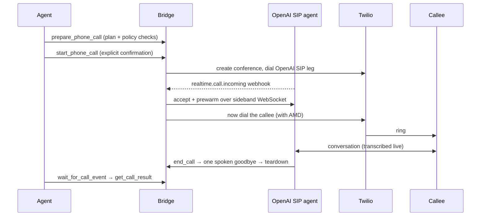

# Agent Phone-Call Bridge

A single-user [FastAPI](https://fastapi.tiangolo.com) + FastMCP service that lets an AI agent (OpenClaw or Hermes Agent) prepare, confirm, start, monitor, and end outbound phone calls for its owner. [Twilio](https://www.twilio.com) dials an [OpenAI](https://openai.com) SIP voice agent into a private conference, the service prewarms `gpt-realtime-2.1` over a sideband WebSocket, and only then rings the callee. SQLite keeps the receipts: plans, state, ordered transcripts, and deterministic final results.

## How a call happens



The callee's phone never rings until the AI is already on the line, warmed up, and ready to speak.

## Built with

| Piece | Job |
| --- | --- |
| OpenClaw / Hermes Agent | MCP client, call intent, optional OpenClaw webhook wake |
| [OpenAI Realtime SIP](https://developers.openai.com/api/docs/guides/realtime-sip) | Voice agent, accept, sideband control |
| [Twilio](https://www.twilio.com) | Conference, callee dial, answering-machine detection |
| [Exa](https://exa.ai) | In-call public-web search |
| [FastAPI](https://fastapi.tiangolo.com) + FastMCP | HTTP surface and MCP tools |
| [Fly.io](https://fly.io) | Production host, volume-backed SQLite |
| [Astral](https://astral.sh) uv / Ruff | Package lock and lint |

## Quick start

You'll need Python 3.12+, [uv](https://docs.astral.sh/uv/), a voice-enabled Twilio account (E.164 caller ID, outbound SIP + Conference Participant AMD), an OpenAI project with Realtime SIP access and a webhook signing secret, an Exa API key, and a stable public HTTPS URL.

```bash
test -e .env.local || cp .env.example .env.local   # guarded: keeps a saved key
uv sync --all-groups --frozen
uv run uvicorn app.main:app --host 0.0.0.0 --port 8000 --reload
```

Fill every required value in `.env.local`. Generate `MCP_BEARER_TOKEN` and `DEBUG_API_TOKEN` with `openssl rand -hex 32`. Leave `ALLOWED_COUNTRY_CODES` unset in dotenv files (the app defaults to `["+1"]`). Never commit env files — `.gitignore` already excludes them.

Then check your work:

```bash
uv run ruff format --check app tests scripts
uv run ruff check app tests scripts
uv run pytest -q
```

### Expose it to the world

Webhooks need a public HTTPS origin. Start the server, then tunnel port 8000:

```bash
ngrok http 8000            # or: cloudflared tunnel --url http://localhost:8000
```

Set `PUBLIC_BASE_URL` to the exact HTTPS origin the tunnel prints — no trailing slash — and restart. This value is security-critical: Twilio signs the full public callback URL.

In **OpenAI Platform → Project → Webhooks**, create `https://YOUR_HOST/webhooks/openai`, subscribe it to `realtime.call.incoming`, and copy the signing secret to `OPENAI_WEBHOOK_SECRET`. The OpenAI project in the SIP URI is `OPENAI_PROJECT_ID`.

No static Twilio webhook is needed — every Conference Participant request carries its own signed status, conference, and AMD callback URLs. Just confirm the Twilio account can call the OpenAI SIP URI and can use AMD on `/Participants`.

### Point an agent at it

**OpenClaw**

```bash
openclaw mcp add agent-call \
  --url https://YOUR_HOST/mcp/ \
  --transport streamable-http \
  --header "Authorization: Bearer <MCP_BEARER_TOKEN>" \
  --header "X-Agent-User-Id: <ALLOWED_AGENT_USER_ID>"
openclaw mcp probe agent-call
```

Optional reverse channel (wake on mid-call questions and post-call summaries): enable hooks in `openclaw.json`, then set:

```text
AGENT_PUSH_ENABLED=true
AGENT_WEBHOOK_URL=https://YOUR_GATEWAY/hooks/agent
AGENT_WEBHOOK_TOKEN=<hooks.token>
```

**Hermes Agent** (`~/.hermes/config.yaml`)

```yaml
mcp_servers:
  agent-call:
    url: "https://YOUR_HOST/mcp/"
    headers:
      Authorization: "Bearer <MCP_BEARER_TOKEN>"
      X-Agent-User-Id: "<ALLOWED_AGENT_USER_ID>"
```

Hermes has no inbound webhook today — leave `AGENT_PUSH_ENABLED=false` and rely on `wait_for_call_event` polling (fully supported; push is best-effort and non-canonical).

Manual MCP client config:

```text
URL:             https://YOUR_HOST/mcp/
Authorization:   Bearer MCP_BEARER_TOKEN
X-Agent-User-Id: ALLOWED_AGENT_USER_ID
Transport:       Streamable HTTP
```

Both the bearer token and `X-Agent-User-Id` are required on every MCP request.

## The seven tools

The server exposes exactly seven MCP tools — no more, no less:

| Tool | What it does |
| --- | --- |
| `prepare_phone_call` | Validate destination policy, persist a plan |
| `start_phone_call` | Explicit confirmation → dial |
| `wait_for_call_event` | Canonical live-call monitoring loop |
| `get_phone_call` | Snapshot of call state |
| `answer_call_question` | Feed an answer to the live agent |
| `end_phone_call` | Manual stop button |
| `get_call_result` | Deterministic final result + transcript |

During a live call, `wait_for_call_event` is the canonical monitoring loop; once it reports a terminal state, call `get_call_result`. Agent push is optional and non-canonical — a push failure is logged and never changes call state.

## Safety rails

- The MCP endpoint requires its bearer token **and** a matching `X-Agent-User-Id` on every request.
- Every OpenAI and Twilio webhook is signature-verified; OpenAI delivery IDs are replay-protected.
- A call cannot start without an unexpired prepared plan **and** explicit confirmation text.
- Destination policy blocks malformed E.164, emergency/N11/short codes, premium-rate prefixes, disallowed country codes, and the service's own Twilio number.
- The voice model may not share or request passwords, auth codes, payment credentials, or government identifiers. It chooses how to open from the approved call context; the bridge does not impose identity, disclosure, or recipient-confirmation wording.
- The agent can press automated phone-menu (IVR) keys via a signed announce webhook, but is instructed never to enter payment, authentication, or identity digits that way.
- The in-call model decides when the conversation is done and invokes its private `end_call` function; the bridge asks for one final spoken goodbye, waits for it, then tears down OpenAI and Twilio.

> [!WARNING]
> Do not deploy or restart while a call is active. Recovery stops stranded billable media and finalizes missing results, but a process restart necessarily ends the live call.

Calls are retained as transcripts. The owner remains responsible for jurisdiction-specific disclosure, recording, robocall, consent, and retention compliance. Apply transcript retention independently of extraction success or failure.

## Live SIP canary

Before trusting a deployment, make it prove itself with a real call to `OWNER_PHONE_E164`:

```bash
uv run python scripts/run_sip_canary.py --mode full
```

Answer the phone, say the printed nonce when asked, and talk over the assistant once. The script gates on accept status, echoed transcription configuration, semantic VAD, nonce transcription, function-tool use, interruption handling, and the terminal result. Then run the second variant to prove the deterministic finalizer does not depend on `record_call_outcome`:

```bash
uv run python scripts/run_sip_canary.py --mode no-outcome-tool
```

Both exit nonzero if any gate fails. The debug evidence endpoint they use requires `DEBUG_API_TOKEN`.

> [!NOTE]
> No mini realtime model can be selected by configuration in v1. Do not relax the `realtime_model` literal or the `MINI_MODELS_ENABLED=false` gate until that exact model passes both canaries, including SIP tool calling.

## Deploying

`fly.toml` defines production at `https://agent-call.fly.dev`: one always-on shared-CPU machine, 512 MB RAM, a 1 GB volume at `/data`, and SQLite at `sqlite:////data/agent_call.db`.

```bash
flyctl config validate
flyctl deploy --ha=false --remote-only
curl -fsS https://agent-call.fly.dev/healthz
```

Set every required value from `.env.example` with `flyctl secrets set` or `flyctl secrets import`. Point the OpenAI project webhook at `https://agent-call.fly.dev/webhooks/openai` (subscribed to `realtime.call.incoming`). After rotating the signing secret:

```bash
flyctl secrets deploy -a agent-call
flyctl status -a agent-call
```

> [!IMPORTANT]
> Keep exactly **one** Machine. SQLite state is volume-local; a second Machine would not share call state. `render.yaml` remains available as a paid Render alternative.

### Rollback

If a bad deploy reaches production, roll back first (do not redeploy while diagnosing):

```bash
# Confirm no active calls (POST acquires the lease; HTTP 409 means wait)
curl --fail-with-body -sS --request POST \
  -H "Authorization: Bearer $DEPLOY_GUARD_TOKEN" \
  https://agent-call.fly.dev/internal/deployment-lock

# List image references and redeploy the previous healthy image
flyctl releases --image -a agent-call
flyctl deploy --image <previous-image-reference> -a agent-call --ha=false --remote-only

# Verify
curl -fsS https://agent-call.fly.dev/healthz
```

Redeploying a prior image restores only the application image without a full rebuild; it does not roll back the current Fly configuration, environment variables, or secrets. Ship a new build only after calls are idle and local checks pass (`ruff`, `mypy`, `pytest`).

**CI/CD:** `.github/workflows/fly-deploy.yml` runs the locked test suite and deploys every push to `main`. It serializes production deployments, waits up to 10 minutes for active calls to finish via the authenticated `/internal/deployment-lock` lease, keeps `--ha=false`, and checks `/healthz` before reporting success. It needs the repository secrets `FLY_API_TOKEN` (app-scoped deploy token) and `DEPLOY_GUARD_TOKEN` — store the latter independently from the MCP and debug tokens; it can only touch the deployment lease. The lease is acquired atomically only when no call is active, blocks new calls while a deployment starts, expires after 15 minutes if canceled, and is cleared by a successful restart.

## The fine print

<details>
<summary><strong>Tuning knobs (timeouts, VAD, search)</strong></summary>

- Live-call control requests use `OPENAI_CONNECT_TIMEOUT_SECONDS` and `OPENAI_HTTP_TIMEOUT_SECONDS` (3 and 10 seconds by default) with no SDK retries; post-call extraction uses `OPENAI_EXTRACTION_TIMEOUT_SECONDS` and keeps its single application-level retry.
- Twilio requests use the pooled, no-retry transport bounded by `TWILIO_HTTP_TIMEOUT_SECONDS`.
- `SEMANTIC_VAD_EAGERNESS` defaults to `auto` (OpenAI's medium-eagerness behavior); set `high` for quicker turn completion.
- `OPENAI_KEEPALIVE_EXPIRY_SECONDS=60` keeps the control-plane TLS connection reusable between sporadic calls; only set it to a bounded 5–300 second value.
- The voice model can call `search_web` for current or uncertain facts. The application fixes Exa Search to `type=auto`, 10 results, moderation, and token-efficient highlights, with a three-second wall-clock deadline controlled by `EXA_SEARCH_TIMEOUT_SECONDS`.
- Locked dependency versions live in `uv.lock` (authoritative).

</details>

<details>
<summary><strong>API/schema decisions</strong></summary>

The implementation follows the current [OpenAI Realtime SIP guide](https://developers.openai.com/api/docs/guides/realtime-sip), [server-side controls guide](https://developers.openai.com/api/docs/guides/realtime-server-controls), [Realtime prompting guide](https://developers.openai.com/api/docs/guides/realtime-models-prompting), [webhook guide](https://developers.openai.com/api/docs/guides/webhooks), [Structured Outputs guide](https://developers.openai.com/api/docs/guides/structured-outputs), [Twilio Conference Participant reference](https://www.twilio.com/docs/voice/api/conference-participant-resource), [Twilio AMD guide](https://www.twilio.com/docs/voice/answering-machine-detection), and [Twilio request validation guide](https://www.twilio.com/docs/usage/security).

Live-schema deviations from the original contract are intentional:

- GA Realtime audio formats are objects such as `{"type":"audio/pcmu"}` when used, but SIP accept/session.update payloads must omit `audio.*.format`. OpenAI negotiates G.711 with the carrier; forcing a format has been observed to clobber PCMU into PCM and leave the callee with silence or static while WebSocket transcripts still advance.
- The current Conference Participants API has no `async_amd` parameter. AMD on Participants is asynchronous by design; the installed SDK uses `machine_detection="DetectMessageEnd"` plus `amd_status_callback` and `amd_status_callback_method`.
- OpenAI call accept is invoked through the installed typed SDK; hangup has no JSON body. REFER's live request field is `target_uri`, but v1 transfer deliberately does not use REFER.
- The installed transcription schema permits `INPUT_TRANSCRIPTION_DELAY` only for `gpt-realtime-whisper`, with `minimal|low|medium|high|xhigh` values.
- The OpenAI SIP agent participant is created with `early_media=false` and is explicitly unmuted before the model's opening turn, because Twilio mutes legs that join with `start_conference_on_enter=false` until the conference starts.

</details>

<details>
<summary><strong>Result semantics</strong></summary>

Telephony state and extraction state remain separate. A successful phone call whose extractor fails stays `call_status=completed`, gets `finalization_status=failed`, `outcome=unknown`, retains its raw transcript, and tells the owner to review it. The service saves a telephony-only result and transcript transactionally before making the external Responses API extraction request. Only transient connection, timeout, or rate-limit failures receive one retry.

</details>
