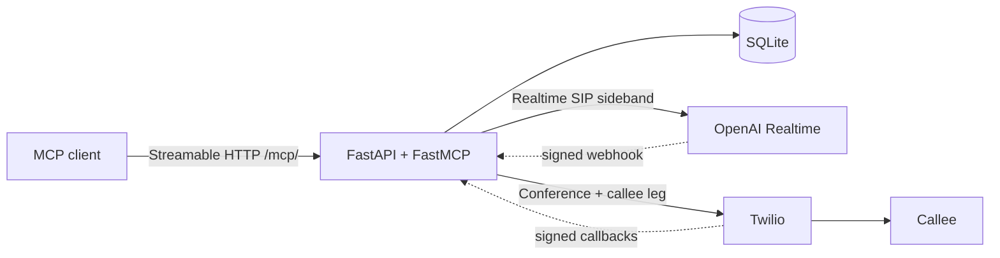

# Architecture

Agent Call is a single-process FastAPI service that mounts an authenticated FastMCP endpoint and coordinates one outbound call at a time for a single owner.

## Components



- **MCP client → FastAPI/FastMCP bridge.** OpenClaw, Hermes Agent, or any Streamable HTTP MCP client calls `/mcp/` with `Authorization: Bearer <MCP_BEARER_TOKEN>` and `X-Agent-User-Id: <ALLOWED_AGENT_USER_ID>`. `app/main.py` assembles FastAPI, mounts FastMCP at `/mcp`, and registers HTTP routes. Routes call `CallService` methods; they never touch `service.db` directly.
- **OpenAI Realtime SIP sideband control.** Twilio dials `sip:<OPENAI_PROJECT_ID>@sip.api.openai.com`. OpenAI posts `realtime.call.incoming` to `/webhooks/openai`. The bridge accepts the SIP call and prewarms the session over a sideband WebSocket (`app/openai_realtime.py`) before the callee is rung.
- **Twilio conference / callee leg.** `app/twilio_bridge.py` creates a conference, adds the OpenAI SIP participant first, then the callee with answering-machine detection. Status, conference, AMD, and DTMF announce callbacks are per-request signed URLs under `/webhooks/twilio`.
- **State machine and SQLite persistence.** `CallService` in `app/call_state.py` owns the lifecycle. The `app/db/` package is a `Database` facade composed from per-concern mixins (engine, plans, deployment, calls, transfers, termination, telemetry, webhooks, transcripts, questions). Default local DB is `sqlite:///./agent_call.db`; production uses a Fly volume.

## Call state

```text
prepared → prewarming → ready_to_activate → activating → active → terminating
                                                              ↘ completed | failed | timed_out | transferred
```

Terminal states: `completed`, `failed`, `timed_out`, `transferred`. Telephony state and extraction state are separate: a successful phone call whose extractor fails stays `call_status=completed` with `finalization_status=failed` and `outcome=unknown`, and still retains the raw transcript.

## Webhook verification and replay protection

- OpenAI: SDK signature unwrap, then `webhook-id` inserted once into `webhook_deliveries` (`app/db/webhooks.py`). Replays return HTTP 400.
- Twilio: `X-Twilio-Signature` is validated against the exact public callback URL (`PUBLIC_BASE_URL` + path + query). Call/plan ids in the query must resolve to a live mapping.

## Explicit call confirmation

`prepare_phone_call` validates destination policy and persists a plan. `start_phone_call` requires that plan to be unexpired and an explicit confirmation flag plus confirmation text. Destination policy (`app/policy.py`) rejects malformed E.164, emergency/N11/short codes, premium-rate prefixes, countries outside `ALLOWED_COUNTRY_CODES`, and the service's own Twilio caller ID.

## Deterministic finalization and transcripts

On teardown, the bridge saves a telephony-only result and ordered transcript transactionally, then optionally calls the OpenAI Responses API for extraction (`app/finalizer.py`). Only transient connection, timeout, or rate-limit failures receive one retry. Extraction failure does not drop the transcript. Optional post-call agent push is best-effort and never canonical.

## Single-instance deployment

SQLite state is volume-local. Production is one Fly Machine. A second instance would accept webhooks and MCP calls against a different database. The deployment lease (`/internal/deployment-lock`) is acquired only when no call is active so deploys do not overlap live media.

## Canonical polling versus optional webhook push

`wait_for_call_event` is the canonical monitoring loop for every MCP client. `AGENT_PUSH_ENABLED` can wake an OpenClaw gateway on mid-call questions and post-call summaries. Push failure is logged and does not change call state. Hermes Agent has no inbound webhook today — leave push off and poll.
