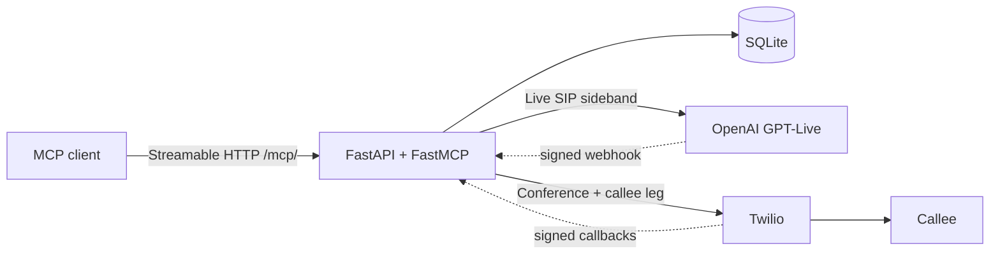

# Architecture

GPT-Live handles full-duplex speech directly over SIP. A concise voice prompt governs
listening, interruptions, acknowledgements and delegation. The delegated Responses backend
(`gpt-5.6-terra`, low reasoning effort) owns approved facts, authority, tools and complex
reasoning. Ordinary conversation does not wait on a separate transcription or VAD request.
There is one Live integration in `app/openai_live.py`; no Realtime adapter or fallback.

The backend requests `finish_call_after_goodbye` only after an actual spoken farewell.
The service matches that farewell to the latest assistant transcript and checks for pending
work. A signed Twilio stream forks the callee's inbound and outbound carrier audio without
relaying the main speech path through the app. Closing requires continuous observed outbound
silence for three seconds after speech. A callee reply cancels closing on the media reader
path, including while the termination database claim waits. A missing stream, stale frames,
or backend completion cannot substitute for playback evidence. The call's overall time limit
still bounds resources when normal conversational closing fails.

Carrier output is not physical-handset receipt. The automated phone harness independently
measures received audio. Treat local tests and native transcript deltas as separate evidence.

Agent Call is a single-process FastAPI service that mounts an authenticated FastMCP endpoint and coordinates one outbound call at a time for a single owner.

`AGENT_CALL_PROFILE=evaluation` is a fail-closed dummy boot: required settings are filled with obvious placeholders, `/healthz` and `prepare_phone_call` work, and `CallService.start` returns `live_calls_disabled` before any OpenAI or Twilio client request. The default evaluation listener is loopback. The live profile is unchanged: `prepare_phone_call` never dials, and `start_phone_call` still requires an unexpired single-use plan, `explicit_confirmation=true`, and the exact confirmation read-back.

## Components



- **MCP client → FastAPI/FastMCP bridge.** A header-capable Streamable HTTP MCP client calls `/mcp/` with `Authorization: Bearer <MCP_BEARER_TOKEN>` and `X-Agent-User-Id: <ALLOWED_AGENT_USER_ID>`. `app/main.py` assembles FastAPI, mounts FastMCP at `/mcp`, and registers HTTP routes. Routes call `CallService` methods; they never touch `service.db` directly. An optional second FastMCP mount at `/connect/mcp/` is created only when `MCP_OAUTH_ENABLED=true`. It exposes the same seven tools against the same `CallService` and is protected by a self-hosted OAuth 2.1 authorization server (PKCE S256, rotating refresh tokens). OAuth is disabled by default and is not a multi-tenant account system. ChatGPT and Claude web setup is documented in [Browser clients](browser-clients.md).
- **OpenAI Live SIP sideband control.** Twilio dials `sip:<OPENAI_PROJECT_ID>@sip.api.openai.com`. OpenAI posts `live.transport.incoming` to `/webhooks/openai`. The bridge accepts the SIP call and prewarms the session over a sideband WebSocket (`app/openai_live.py`) before the callee is rung.
- **Twilio conference / callee leg.** `app/twilio_bridge.py` creates a conference, adds the OpenAI SIP participant first, then the callee with answering-machine detection. Status, conference, AMD, and DTMF announce callbacks are per-request signed URLs under `/webhooks/twilio`.
- **State machine and SQLite persistence.** `CallService` in `app/call_state.py` owns the lifecycle. The `app/db/` package is a `Database` facade composed from per-concern mixins (engine, plans, deployment, calls, transfers, termination, telemetry, webhooks, transcripts, questions, oauth). Default local DB is `sqlite:///./agent_call.db`; production uses a Fly volume. Optional MCP OAuth stores hashed authorization codes and refresh tokens plus encrypted client records in the same SQLite file; it does not add Redis or Postgres. Public DCR is capped at 64 clients with unused-client eviction; `oauth_audit` is retained 90 days and capped at 2048 newest rows. Expired token rows are purged at startup and when a token pair is issued.

## Call state

```text
prepared → prewarming → ready_to_activate → activating → active → terminating
                                                              ↘ completed | failed | timed_out | transferred
```

Terminal states: `completed`, `failed`, `timed_out`, `transferred`. Telephony state and extraction state are separate: a successful phone call whose extractor fails stays `call_status=completed` with `finalization_status=failed` and `outcome=unknown`, and still retains the raw transcript.

Once a correlated `session.updated` confirms the Live model and Responses backend,
the callee is dialed. After the callee answers, the service binds the carrier monitor,
unmutes the SIP participant, and appends the connected instruction. Native full-duplex
speech handles greetings, menus and interruptions; there are no manual voice-response
creation commands or application VAD settings.

Voicemail greetings and hold music are handled by the native listening policy. Only a
provider `machine_end_beep` or `machine_end_silence` result authorizes a voicemail message.
Ambiguous AMD results do not establish recording readiness. Fax detection terminates.
The backend records hold state through `report_hold` and clears it with `holding=false`
when a person returns or a menu needs input; the voice frontend can respond naturally.

## Delegated tools and usage

Collect function calls from nested `response.output_item.done` events. Argument fragments
and empty terminal output arrays are not a source of executable calls. Emit one
`response.item.create` result for each call, wait for all results and backend completion,
then send one body-free `response.create`. This continues backend work, not voice playback.
An accepted final closing result does not start another backend turn. Its farewell is
already spoken and the application owns the reply window. If native delegation omits
the closing handoff, observed farewell audio can request a backend review; a transcript
keyword alone never authorizes hangup.
Owner answers, search, DTMF and transfer retain their application authorization and timeout
checks. A new callee turn invalidates queued consequential actions from an older response.
Responses are correlated individually because one delegation ID can be reused across turns.

Persist transcript fragments exactly, retaining session `start_ms` and `end_ms` separately
from receipt timestamps. Live duration comes from cumulative `session.usage.updated`
snapshots and final `session.closed`; backend tokens are separately deduplicated by response
ID. Teardown hangs up carrier legs while the sideband receives final usage after
`session.close`, with a bounded timeout that leaves finalization unconfirmed on failure.
Delayed usage never extends the callee's reply window. Historical Realtime
cost columns remain readable for old records; new sessions never write Realtime token usage.

## Webhook verification and replay protection

- OpenAI: SDK signature verification followed by Live schema validation, then `webhook-id` inserted once into `webhook_deliveries` (`app/db/webhooks.py`). Replays return HTTP 400.
- Twilio: `X-Twilio-Signature` is validated against the exact public callback URL (`PUBLIC_BASE_URL` + path + query). Call/plan ids in the query must resolve to a live mapping.

The carrier WebSocket additionally validates a single-use random token, call/account IDs,
stream identity, both tracks and G.711 format. It never stores raw audio. A stream closure
is reconciled with Twilio call state before being classified as monitor loss.

## Explicit call confirmation

`prepare_phone_call` validates destination policy and persists a plan. `start_phone_call` requires that plan to be unexpired and an explicit confirmation flag plus confirmation text. Destination policy (`app/policy.py`) rejects malformed E.164, emergency/N11/short codes, premium-rate prefixes, countries outside `ALLOWED_COUNTRY_CODES`, and the service's own Twilio caller ID.

## Deterministic finalization and transcripts

On teardown, the bridge saves a telephony-only result and ordered transcript transactionally, then optionally calls the OpenAI Responses API for extraction (`app/finalizer.py`). Only transient connection, timeout, or rate-limit failures receive one retry. Extraction failure does not drop the transcript. Optional post-call agent push is best-effort and never canonical.

## Single-instance deployment

SQLite state is volume-local. Production is one Fly Machine. A second instance would accept webhooks and MCP calls against a different database. The deployment lease (`/internal/deployment-lock`) is acquired only when no call is active so deploys do not overlap live media.

## Canonical polling versus optional webhook push

`wait_for_call_event` is the canonical monitoring loop for every MCP client. `AGENT_PUSH_ENABLED` can wake an OpenClaw gateway on mid-call questions and post-call summaries. Push failure is logged and does not change call state. Hermes Agent has no inbound webhook today — leave push off and poll.
