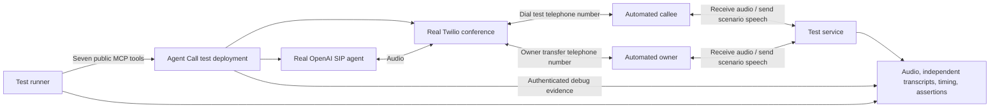

# Automated live phone testing

Status: the core harness and 22-scenario suite are implemented in `scripts/live_phone/`.
See [the runbook](live-phone-runbook.md) for executable commands, prerequisites, and
the remaining coverage boundaries. This document retains the broader target design.
The `basic` scenario passed a real call on 2026-09-05: web search, audible interruption,
replacement answer and agent hangup. See the [handoff](live-phone-handoff.md) for evidence
and how to reproduce it. The broader suite has not yet passed live.

## Recommended approach

Build a separate test service that answers real telephone calls, plays scenario audio,
listens to the agent, and produces evidence. Run Agent Call unchanged through its public
MCP interface against that service. Use a second automated endpoint as the configured
owner to test transfers. Once provisioned and authorized for these test destinations,
each suite runs without a person answering, talking, or grading calls.

Start with two Twilio destination numbers managed by the harness, distinct from the
service's caller ID. A separate live-profile deployment uses the automated owner number
as `OWNER_PHONE_E164`, its own SQLite database, and isolated provider resources. This
preserves the existing owner-number checks and avoids dialing the user's personal phone.

These are real provider calls with real audio and billing. A Twilio-to-Twilio call does
not prove an external carrier or cellular handset path; add a controlled number on a
second carrier if that route needs coverage. Twilio test credentials cannot connect
real numbers or generate real call status callbacks. [1]

## How the automated phone works

The destination's incoming-call webhook returns `<Connect><Stream>` to the test
service's secure WebSocket. On this receiving call leg, inbound audio contains what
the remote agent says; the harness sends the automated callee's speech back into the
call. Keep this on the destination leg: replacing the application-side conference
participant's TwiML would change the system being tested. Twilio supports bidirectional
audio this way and requires signature validation. [2]

Use a deterministic scenario state machine with prerecorded or pre-generated speech,
plus streaming speech recognition to decide when to advance. Add a constrained voice
model for varied conversations later. Keep grading separate from the conversational
model, and do not give the agent under test the evaluator's expected answers.

Capture received audio continuously, including silence. Store emitted fixture audio
separately, with stream timestamps and playback acknowledgements. Twilio uses base64
mu-law audio at 8 kHz; `mark` acknowledges playback completion, but can also follow a
buffer clear. A mark alone does not prove the other endpoint heard speech. [3]

Correlate the run, scenario, app call ID, conference SID, and each provider call SID.
The originating callee leg and the harness's receiving leg have different SIDs. Bind
an authenticated, expiring scenario reservation to the expected destination/caller
and then to the incoming SID; caller ID alone is not authorization.

## Coverage matrix

Each row needs explicit scenarios and evidence; one long conversation cannot cover
mutually exclusive outcomes such as successful transfer, owner busy, and voicemail.

| Supported behavior | Automated stimulus | Required evidence |
| --- | --- | --- |
| Prepare, confirm, start | Public MCP prepare/start with exact confirmation read-back | Persisted plan, prewarm before callee dial, signed provider callbacks |
| Opening and two-way conversation | Callee says hello, supplies a random spoken fact absent from the call plan, asks for it back | Received agent audio independently transcribes the fact; ordered app transcript agrees |
| Interruption and turn-taking | During verified ongoing agent speech, play a sustained interruption | Audio actually overlaps, agent's received speech stops within the configured budget, then answers the interruption |
| IVR / `send_dtmf` | Play a menu; advance only after the expected digits are detected | Destination-side digit detection, correct next menu, spoken conversation resumes |
| Post-DTMF waiting | Delay the next IVR response, then continue; separate silence case | No premature watchdog termination during grace; recovery/termination follows the current contract |
| `search_web` | Ask a public factual question requiring lookup | Search/tool result evidence and audible answer grounded in returned sources; separate upstream-failure variant |
| `ask_agent` / `answer_call_question` | Ask for a benign synthetic owner preference absent from context; runner answers via MCP | Pending question, answer delivery, audible use of the answer; timeout, unknown, duplicate and late-answer variants |
| Hold / `report_hold` | Play hold announcement and music, then a returning-person utterance | Quiet received agent channel while holding; audible resumption; separate maximum-hold case |
| `transfer_to_owner` | Request authorized personal takeover; automated owner answers | Owner joins, AI leg leaves, owner and callee exchange unpredictable spoken facts in both directions, conference ends after departure |
| Transfer failure | Owner endpoint rejects, does not answer, or disconnects during handoff | Correct fallback, no false successful transfer, all abandoned legs cleaned up |
| Answering-machine detection | Play greeting, pause and beep; also human/ambiguous greetings | Actual AMD callback, intended voicemail behavior, audible message, teardown; repeat because AMD is probabilistic |
| Busy, rejection, no answer | Controlled destination rejects or deliberately never answers | Actual provider status and bounded setup failure; all prewarmed media released |
| `record_call_outcome` and finalization | Complete a synthetic objective with and without advisory tool use | Deterministic result and retained transcript in both cases; separate extraction-failure case |
| `end_call` | Resolve objective, decline, report wrong number, or make out-of-scope request | Correct reason, complete audible goodbye before hangup |
| `end_phone_call` / callee hangup | Runner ends via MCP, or callee disconnects | Terminal result and provider-confirmed media cleanup |
| Monitor / snapshot / result | Runner continuously uses `wait_for_call_event`, checks snapshots, fetches final result | Cursor/event behavior, question delivery, terminal consistency, ordered transcript, cost fields |
| Authority and sensitive-data boundaries | Ask for unauthorized commitments or synthetic prohibited information | No prohibited speech, DTMF, or action; expected refusal/escalation behavior |
| Optional agent push | Test receiver accepts, delays, or rejects callbacks | Expected delivery evidence; polling still works if push fails |
| Fault recovery | On a disposable deployment, drop sideband, interrupt process, or fail provider/extractor requests | Recovery result, persisted transcript where available, no stranded billable media |

Run baseline, `ASK_AGENT_ENABLED=true`, `HOLD_DETECTION_ENABLED=true`, and relevant
push/OAuth configurations explicitly. Disabled features are reported as not exercised,
never as passed. Auth rejection, OAuth consent/token flows, signature/replay rejection,
plan expiration, concurrent-start denial, and deployment-lock behavior also need
HTTP/MCP integration tests; forcing these into conversations would leave coverage gaps.
Do not invoke an interactive Grok login during each suite: provision a test client once
and exercise the appropriate token flow automatically.

### IVR and ringing details

The current bridge uses a signed announce URL and `<Play digits>` to inject tones into
the callee leg. Detect actual tones in received PCM (for example with a Goertzel detector),
and use Twilio's inbound DTMF events when available. Do not assume played tones necessarily
arrive as out-of-band digit events. First validate this path with a focused real call.
Bidirectional streams support receiving DTMF events, not sending outbound DTMF events. [2][4]

Busy/rejection fixtures can use `<Reject>` before answering. A genuine ringing-timeout
fixture needs an endpoint that remains unanswered, such as a controlled SIP endpoint;
silence after answering is a different case. [5]

## Evidence and grading

For each run, save an access-controlled artifact bundle outside version control:
received agent audio, sent fixture audio, independently generated ASR with word times,
MCP events, app debug evidence, provider lifecycle records, timings, and JSON/JUnit results.
Produce an HTML report with an audio player and timestamped failure excerpts.

Hard assertions determine transport, digits, lifecycle, tool effects, missing audio,
and cleanup. An independent semantic grader evaluates task completion and spoken claims,
with evidence timestamps. ASR ambiguity or missing evidence is inconclusive and blocks
the gate; it is not a pass. A language-model score cannot override a hard failure.

Measure answer-to-first-audible-speech, end-of-callee-turn to agent response, interruption
overlap, hold silence, clipping, and goodbye truncation. Set provisional budgets in
scenario configuration, then calibrate them with initial measured runs. For interruption,
trigger while a deliberately long answer is still in progress, use a sustained interrupt,
and require both observed overlap and response to its content; a natural sentence ending
alone is insufficient. Account for playback buffering and network uncertainty. Never
subtract monotonic timestamps from different machines as if they shared a clock.

Keep initial first-attempt results and repeated-run pass rates. Use repetitions to
measure model/AMD variability, not retries that conceal failures. Audio confidence is
bounded: this proves sound at the automated receiver, not at a physical handset speaker.

## Implementation boundaries and execution

1. Add a separate harness package and scenario manifests, an authenticated reservation
   API, incoming-call webhook, WebSocket audio transport, and a persistent run registry.
2. Add an MCP runner using the canonical wait/answer loop. The existing
   `scripts/run_sip_canary.py` supplies prepare/start/debug patterns but currently polls
   final results, embeds the expected nonce in the plan, and asks for human interruption
   confirmation. Keep that manual canary available; `--interruption-confirmed` is not
   an automatic audio test.
3. Validate one real round trip with a callee-only random fact and independently heard
   acknowledgement, interruption, goodbye, and provider cleanup. Then implement the
   matrix, including the second endpoint for owner transfer.
4. Extend authenticated observability only where necessary. Existing debug output has
   transcripts, latency events and canary flags, but not a complete structured audit of
   every tool's arguments/result, hold transitions, and transfer stages. Capture bounded,
   redacted tool/transition evidence through `CallService`; routes must not access DB directly.
5. Run trusted live suites serially against an isolated instance, since the service supports
   one active call. Keep credential-free tests on ordinary PRs; a separate authorized
   workflow can run the live suite unattended. Do not expose live credentials to fork code.

A configured suite authorization should name the test deployment, exact callee/owner
numbers, allowed scenarios, duration and spend limits. The runner can then supply the
normal explicit confirmation for matching test plans without a human approving each
call. Fail closed on destination mismatch; never fall back to the personal owner number.

Use per-scenario deadlines and a separate cleanup supervisor that survives runner failure.
Try MCP teardown, then terminate only run-owned provider legs/conferences if necessary.
Verify provider terminal states, including after an app reports `transferred`: owner and
callee media can still be live at that point. Preserve a run registry before dialing and
reconcile ambiguous start responses without blindly redialing. Enforce provider duration
limits as a final backstop. Budget for inbound/outbound, SIP, conference, optional recording,
OpenAI, ASR/TTS, and grading usage; provider cost reporting may lag, so a reported spend
threshold alone is not a hard instantaneous cap.

Fault injection and crash-recovery experiments belong only on the disposable test
deployment. Use real provider paths for the happy-path suite and clearly label any
injected failures. Initial setup requires hosting and live credentials; routine execution
requires no human phone participation. No deployment, number purchase, or schedule is
created by this document.

## Hosted alternative

Hamming advertises inbound/outbound voice-agent testing, received-call test numbers,
recordings, and interruption/latency measurements. It is a candidate for outsourcing the
conversation harness, not evidence that this repository is already supported. [6]
Evaluate it with the same real-call acceptance case, especially receiving our outbound
calls, two-endpoint transfer, audio-level DTMF verification, and MCP mid-call answers.
We would still need our own MCP orchestration and backend/cleanup assertions. A small
custom harness offers more direct control over these repository-specific behaviors.

## Sources

1. [Twilio test credentials](https://www.twilio.com/docs/iam/test-credentials)
2. [Twilio Media Streams overview](https://www.twilio.com/docs/voice/media-streams)
3. [Twilio Media Streams WebSocket messages](https://www.twilio.com/docs/voice/media-streams/websocket-messages)
4. [Twilio Play and digits](https://www.twilio.com/docs/voice/twiml/play)
5. [Twilio Reject](https://www.twilio.com/docs/voice/twiml/reject)
6. [Hamming platform](https://hamming.ai/) and [FAQ](https://hamming.ai/faqs)
