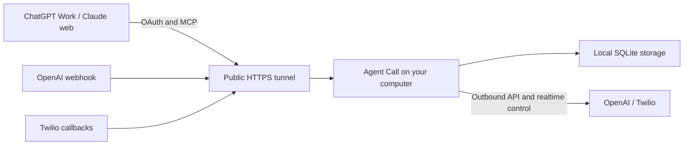

# Run locally and connect browser clients

Agent Call can run on your computer while ChatGPT Work and Claude web use it through a public HTTPS tunnel. Installing the Python package does not deploy a cloud server or create a public URL. A local installation also does not make the service offline: it still uses OpenAI and Twilio over the internet.

## What has actually been verified

| Path | Current evidence |
| --- | --- |
| Isolated Fly.io server → ChatGPT Work / Claude web | Browser OAuth, plan preparation, and real question-and-answer calls; see the exact [audio and client limits](browser-clients.md#verification-status) |
| Installed wheel/source package → local MCP client | Clean uv/pip installs, startup, health, and plan preparation passed; see [package validation](package-validation.md) |
| Installed package on this Mac → automatic HTTPS tunnel → protocol client | Public health, OAuth discovery/DCR/PKCE/consent/token exchange, seven tools, plan preparation and idle shutdown passed; restart with saved configuration also passed |
| Installed package on a laptop → HTTPS tunnel → ChatGPT Work / Claude web | Actual browser conversations through this packaged local instance have not yet been tested; protocol success is not browser acceptance |

Do not present the Fly test as proof that the packaged laptop installation has passed browser or phone acceptance.

## How the connection works

The browser connector request comes from the provider's infrastructure. Entering `http://localhost:8000` in a web connector does not give that provider access to your computer. OpenAI documents a public HTTPS endpoint or Secure MCP Tunnel for development, and explicitly permits HTTPS forwarding for local testing. Claude's custom remote connectors require reachability from Anthropic's cloud. [OpenAI connection guide](https://developers.openai.com/plugins/deploy/connect-chatgpt), [Claude network requirements](https://support.claude.com/en/articles/11175166-get-started-with-custom-connectors-using-remote-mcp).

For Agent Call's common two-client path, forward a public HTTPS origin to `http://127.0.0.1:8000`. The same origin must reach OAuth discovery and authorization routes, `/connect/mcp/`, `/webhooks/openai`, and `/webhooks/twilio/*`. Forwarding only `/connect/mcp/` is insufficient. Preserve paths, query strings, headers, and callback bodies: webhook authentication depends on them. Keep the app's authentication and signature validation enabled.

The local process makes outbound API requests and opens its own outbound OpenAI realtime WebSocket. Phone audio flows between Twilio and OpenAI SIP; this app does not require opening a local SIP port or an inbound audio WebSocket. OpenAI describes the incoming webhook and subsequent outbound monitoring connection in its [Realtime SIP guide](https://developers.openai.com/api/docs/guides/realtime-sip).

OpenAI's Secure MCP Tunnel is another way to connect an MCP server to supported OpenAI products. It is not, by itself, a shared solution for Claude plus this application's OpenAI/Twilio webhook ingress. That conclusion follows from the app's separate callback routes; no Secure MCP Tunnel integration has been validated here. [Secure MCP Tunnel documentation](https://developers.openai.com/api/docs/guides/secure-mcp-tunnels).

## Try the package yourself

1. Follow the [local wheel installation instructions](package-release.md#install-with-uv), or use the pip virtual environment alternative. All Python runtime dependencies install automatically.
2. Run `agent-call start`. It obtains an account-free temporary HTTPS address by downloading and verifying a pinned official cloudflared helper automatically. You do not need to install a tunnel executable yourself. Its private config/data directory defaults to `~/.agent-call`; use `--directory /path/to/private-folder` for a separate trial.
3. Complete the terminal prompts for your provider configuration and owner details. The wizard supplies the public origin and displays the OpenAI webhook URL to configure. It generates internal tokens and browser OAuth keys. Keep the owner login password in your password manager. The application does not create provider accounts or configure the OpenAI dashboard on your behalf.
4. Add a separate local-test connector in each browser using the printed `https://YOUR_HOST/connect/mcp/` URL and authorize with your owner login password. Test discovery and preparation first. A returned plan proves preparation, not a phone connection. For a no-dial trial, start with `--profile evaluation`; the same setup prompts apply, but dialing is blocked.
5. In live mode, perform a first call only after reviewing and explicitly approving its recipient and plan, using a consenting test recipient. Verify audible conversation, hangup, and final result separately. Use `agent-call doctor --live-ready` from the config directory if you need provider/readiness diagnostics; an `UNVERIFIED` result remains unverified.

For the existing manual workflow, start your own HTTPS forwarding service, run `agent-call setup` in a private working directory, and then run `agent-call serve --profile live` from that directory. Managed `start` isolates runtime configuration from ambient shell provider variables; manual `serve` retains the documented environment override behavior.

Use separate test configuration and connectors so a local trial does not replace an existing deployment. A shared OpenAI project's webhook configuration can affect other instances; use a dedicated project for independent tests.

The computer must remain awake and online, and both Agent Call and the tunnel must stay running through the call and finalization. If a tunnel restart changes its URL, managed startup updates `PUBLIC_BASE_URL`; update the OpenAI webhook and both browser connector URLs while calls are idle, then reconnect. A stable tunnel hostname reduces repeated setup.

Cloudflare Quick Tunnels are temporary development endpoints with no uptime guarantee; Cloudflare also documents no SSE support. This app currently uses JSON responses for Streamable HTTP (`json_response=True`), so that limitation alone does not establish incompatibility, but the exact browser/tunnel path still needs acceptance testing. Do not infer it from a health check. [Quick Tunnel limitations](https://developers.cloudflare.com/cloudflare-one/networks/connectors/cloudflare-tunnel/do-more-with-tunnels/trycloudflare/).

## How to describe the product

> Install Agent Call with uv or pip and run it on your own computer or server. To use ChatGPT Work or Claude web, give the service a reachable HTTPS address: use a tunnel for local trials, or a hosted instance for continuous availability. Bring your own OpenAI and Twilio accounts; Exa search is optional.

Local plus tunnel is the first user-experience test to complete before claiming the package is ready for browser users. Hosting on Fly.io or another server removes dependence on keeping a personal laptop awake, but remains a separate deployment step. Neither uv nor pip installation includes managed hosting.
