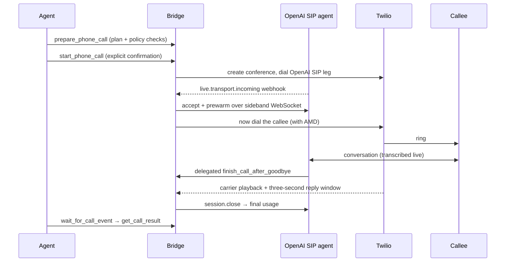

# Technical reference

Details for contributors and operators. For installation, start with the [README](../README.md).

## How a call happens

The callee's phone never rings until the AI is already on the line, warmed up, and ready to speak.

See [docs/architecture.md](architecture.md) for components, state, persistence, and webhook verification.

## MCP tools

The server exposes exactly seven MCP tools:

| Tool | What it does |
| --- | --- |
| `prepare_phone_call` | Validate destination policy, persist a plan |
| `start_phone_call` | Explicit confirmation → dial |
| `wait_for_call_event` | Canonical live-call monitoring loop |
| `get_phone_call` | Snapshot of call state |
| `answer_call_question` | Feed an answer to the live agent |
| `end_phone_call` | Manual stop button |
| `get_call_result` | Deterministic final result + transcript |

During a live call, `wait_for_call_event` is the canonical monitoring loop; once it reports a terminal state, call `get_call_result`. Agent push is optional and non-canonical — a push failure is logged and never changes call state.

## Safety properties

- The legacy MCP endpoint (`/mcp/`) requires its bearer token **and** a matching `X-Agent-User-Id` on every request. Optional browser OAuth on `/connect/mcp/` is disabled by default and does not replace that gate.
- Every OpenAI and Twilio webhook is signature-verified; OpenAI delivery IDs are replay-protected.
- A call cannot start without an unexpired prepared plan **and** explicit confirmation text.
- Destination policy blocks malformed E.164, emergency/N11/short codes, premium-rate prefixes, disallowed country codes, and the service's own Twilio number.
- The voice model may not share or request passwords, auth codes, payment credentials, or government identifiers. It chooses how to open from the approved call context; the bridge does not impose identity, disclosure, or recipient-confirmation wording.
- The agent can press automated phone-menu (IVR) keys via a signed announce webhook, but is instructed never to enter payment, authentication, or identity digits that way.
- The voice frontend says goodbye, then delegates `finish_call_after_goodbye`; the bridge verifies the farewell and carrier playback, preserves three seconds for a reply, then finalizes Live and releases Twilio.
- Evaluation/dummy profile: `prepare_phone_call` still persists a plan; `start_phone_call` returns `live_calls_disabled` before any OpenAI or Twilio client request.

> [!WARNING]
> Do not deploy or restart while a call is active. Recovery stops stranded billable media and finalizes missing results, but a process restart necessarily ends the live call.

## Built with

| Piece | Job |
| --- | --- |
| ChatGPT / Work / Claude web | Intended primary MCP clients; see [verification status](browser-clients.md) |
| [OpenAI GPT-Live SIP](https://developers.openai.com/api/docs/guides/voice-sip?api=live) | Voice agent, accept, sideband control |
| [Twilio](https://www.twilio.com) | Conference, callee dial, answering-machine detection |
| [Exa](https://exa.ai) | Optional in-call public-web search |
| [FastAPI](https://fastapi.tiangolo.com) + FastMCP | HTTP surface and MCP tools |
| [Fly.io](https://fly.io) | Optional one-instance web host, volume-backed SQLite |
| [Astral](https://astral.sh) uv / Ruff | Package lock and lint |
